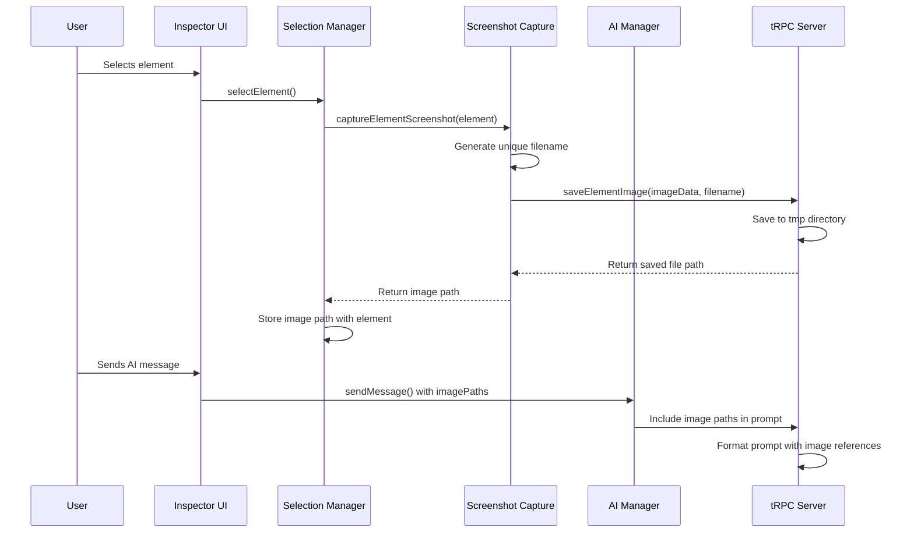

# Technical Design: Inspector Element Capture

## Overview

This feature extends the existing InstantCode inspector to automatically capture element screenshots when sending messages to AI. Images are saved to a tmp directory with unique filenames and their paths are included in AI messages to provide visual context for more accurate responses.

**Users**: Developers using the InstantCode inspector will automatically get enhanced AI interactions with visual context.

**Impact**: Enhances existing AI communication by adding visual element context without changing the core user experience.

### Goals
- Automatically capture element screenshots during AI interactions
- Save images with unique identifiers to prevent conflicts  
- Include image paths in AI messages for visual context

### Non-Goals
- Manual image capture controls or UI
- Image editing or manipulation features
- Image storage beyond current session (tmp directory cleanup handled externally)

## Architecture

### Existing Architecture Integration

This feature extends the current dual-architecture pattern:
- **Client Component Extension**: Adds screenshot capture to existing element selection workflow
- **Server Component Extension**: Adds image file management via existing tRPC API
- **Integration Layer**: Leverages existing AI message flow with additional image path data

**Architecture Integration**:
- Existing patterns preserved: tRPC client-server communication, element selection workflow
- New components rationale: Minimal additions to existing modules for screenshot and file operations
- Technology alignment: Uses existing TypeScript, tRPC, browser APIs, Node.js file operations
- Steering compliance: Follows existing module organization and error handling patterns

### Technology Alignment

**Client-Side Extensions**:
- Browser Canvas API for element screenshot capture
- Existing tRPC client for server communication
- Integration with current selection.ts module

**Server-Side Extensions**:
- Node.js fs module for file operations
- Existing tRPC router for new image management endpoint
- Standard path utilities for filename generation

**Key Design Decisions**:

**Decision**: Use Browser Canvas API for client-side screenshot capture  
**Context**: Need to capture element images in browser without external dependencies  
**Alternatives**: html2canvas library, server-side browser automation, third-party screenshot services  
**Selected Approach**: Browser's native getDisplayMedia/canvas toBlob APIs for direct element capture  
**Rationale**: Zero additional dependencies, works in all modern browsers, simple integration  
**Trade-offs**: Limited to visible elements vs. more features but maintains simplicity

**Decision**: Extend existing tRPC flow rather than separate image upload endpoint  
**Context**: Need to coordinate image capture with AI message sending  
**Alternatives**: Separate REST endpoint for images, WebSocket-based image streaming, direct file upload  
**Selected Approach**: Add image management to existing tRPC router and extend SendMessage schema  
**Rationale**: Leverages existing type-safe communication, maintains consistency with current architecture  
**Trade-offs**: Couples image handling to AI workflow vs. decoupled but adds complexity

## System Flows

### Element Screenshot Capture Flow



## Requirements Traceability

| Requirement | Requirement Summary | Components | Interfaces | Flows |
|-------------|-------------------|------------|------------|-------|
| 1.1 | Capture element screenshots | Screenshot Capture, Selection Manager | captureElementScreenshot() | Element Screenshot Capture |
| 1.2 | Save images to tmp directory | tRPC Server, File Manager | saveElementImage() | Element Screenshot Capture |
| 1.3 | Generate unique filenames | Screenshot Capture | generateImageFilename() | Element Screenshot Capture |
| 2.1 | Include image paths in AI messages | AI Manager, tRPC Router | sendMessage() | Element Screenshot Capture |
| 2.2 | Use descriptive filenames | Screenshot Capture | generateImageFilename() | Element Screenshot Capture |
| 3.1 | Ensure unique filenames | Screenshot Capture | generateImageFilename() | Element Screenshot Capture |
| 3.2 | Organize in tmp directory | tRPC Server | saveElementImage() | Element Screenshot Capture |

## Components and Interfaces

### Client-Side Extensions

#### Screenshot Capture Module

**Responsibility & Boundaries**
- **Primary Responsibility**: Capture element screenshots using browser APIs and coordinate with server for storage
- **Domain Boundary**: Client-side image capture and file path management
- **Data Ownership**: Temporary image data during capture process

**Dependencies**
- **Inbound**: Selection Manager (when elements are selected)
- **Outbound**: tRPC Client (for server communication), Browser Canvas API
- **External**: Browser Canvas/Screenshot APIs

**Contract Definition**

**Service Interface**:
```typescript
interface ScreenshotCaptureService {
  captureElementScreenshot(element: Element): Promise<Result<string, CaptureError>>;
  generateImageFilename(element: Element): string;
}

interface CaptureError {
  type: 'BROWSER_NOT_SUPPORTED' | 'CAPTURE_FAILED' | 'UPLOAD_FAILED';
  message: string;
}
```

- **Preconditions**: Element must be visible in viewport
- **Postconditions**: Image file saved to server with unique filename returned
- **Invariants**: Each capture generates a unique filename

#### Selection Manager Extensions

**Responsibility & Boundaries**
- **Primary Responsibility**: Extend existing element selection to include image capture coordination
- **Domain Boundary**: Element selection workflow with image context
- **Data Ownership**: Selected element data including associated image paths

**Integration Strategy**:
- **Modification Approach**: Extend existing selectElement method to trigger screenshot capture
- **Backward Compatibility**: All existing functionality maintained
- **Migration Path**: Additive changes only, no breaking changes to current API

### Server-Side Extensions

#### Image Management Service

**Responsibility & Boundaries**
- **Primary Responsibility**: Save element images to tmp directory with unique filenames
- **Domain Boundary**: Server-side file storage and path management
- **Data Ownership**: Saved image files and their file paths

**Dependencies**
- **Inbound**: tRPC Router (image save requests)
- **Outbound**: Node.js fs module, path utilities
- **External**: File system for tmp directory storage

**Contract Definition**

**API Contract**:
| Method | Endpoint | Request | Response | Errors |
|--------|----------|---------|----------|--------|
| POST | saveElementImage | SaveImageRequest | SaveImageResponse | 400, 500 |

```typescript
interface SaveImageRequest {
  imageData: string; // base64 encoded
  filename: string;
  elementInfo: ElementIdentifier;
}

interface SaveImageResponse {
  success: boolean;
  imagePath: string;
  filename: string;
}

interface ElementIdentifier {
  xpath: string;
  cssSelector: string;
  tagName: string;
}
```

**State Management**:
- **Persistence**: Images stored in tmp directory under project root
- **Concurrency**: File operations use atomic writes with unique filenames

#### tRPC Router Extensions

**Integration Strategy**:
- **Modification Approach**: Add new saveElementImage procedure to existing router
- **Backward Compatibility**: Extend SendMessage schema to include optional imagePaths array
- **Migration Path**: Additive schema changes with optional fields

## Data Models

### Logical Data Model

**Enhanced Element Data**:
```typescript
interface ElementDataWithImage extends ElementData {
  imagePath?: string; // Optional path to captured screenshot
}
```

**Image Metadata**:
```typescript
interface ElementImageMetadata {
  filename: string;
  filepath: string;
  capturedAt: Date;
  elementXPath: string;
  elementSelector: string;
}
```

### Data Contracts & Integration

**Extended SendMessage Schema**:
```typescript
interface SendMessageWithImages extends SendMessage {
  imagePaths?: string[]; // Array of captured image file paths
}
```

**Image File Naming Convention**:
- Format: `element-{timestamp}-{elementHash}-{index}.png`
- Example: `element-20250909115000-abc123-1.png`
- Location: `{projectRoot}/tmp/inspector-captures/`

## Error Handling

### Error Strategy

**Client-Side Error Handling**:
- **Browser Compatibility**: Graceful degradation when screenshot APIs unavailable
- **Capture Failures**: Continue with AI message without images, log warning
- **Network Failures**: Retry image upload, fallback to no-image mode

**Server-Side Error Handling**:
- **File System Errors**: Return error response, ensure tmp directory exists
- **Invalid Image Data**: Validate base64 format, return validation error
- **Storage Full**: Handle disk space issues gracefully

### Error Categories and Responses

**User Errors**: Invalid element selection → capture skipped with notification  
**System Errors**: Screenshot API failure → graceful degradation to text-only mode  
**Business Logic Errors**: File save conflicts → automatic filename generation with suffix

### Monitoring

**Client-Side Logging**: Screenshot capture success/failure rates, timing metrics  
**Server-Side Logging**: Image save operations, tmp directory usage, cleanup events

## Testing Strategy

### Unit Tests
- Screenshot capture module with mocked browser APIs
- Image filename generation with collision handling
- tRPC image save procedure with file system mocks
- SendMessage schema validation with image paths

### Integration Tests  
- End-to-end element selection to image capture flow
- tRPC client-server image upload communication
- AI message formatting with image path inclusion
- File system operations in tmp directory

### E2E Tests
- Complete user workflow from element selection to AI response
- Multiple element selection with multiple image captures
- Error scenarios with fallback to text-only mode